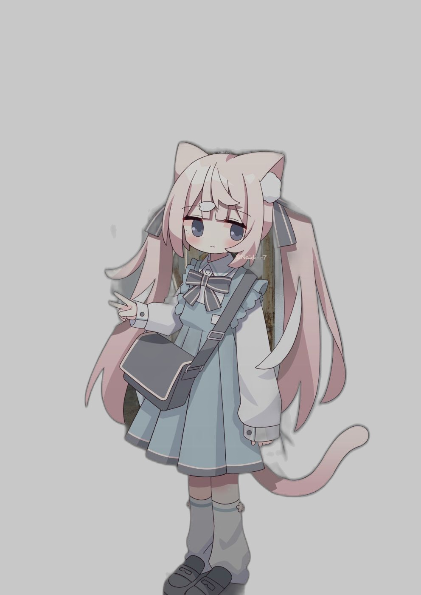

# MyPet 🐾 猫娘桌宠

跨平台桌面宠物应用：**Windows (.exe) + Android (.apk)** 单代码库（Flutter）。
基于一张静态立绘（`source_assets/1.jpg`），通过自动抠图 + 分层 + 代码驱动 Transform 实现全部动效。



## 功能

| 类别 | 能力 |
|---|---|
| 基础 | 等比缩放（`Ctrl+Alt+↑/↓` / 托盘 / 设置面板滑块）、点击头/身/尾不同音效+动效、预设台词气泡（打字机效果，闲置随机弹出）、双透明度可调 |
| 视线 | 眼球+头部实时跟随鼠标（`GetCursorPos` 自适应轮询：移动 60fps / 静止 11fps，**零钩子零杀软风险**），Android 端跟随触摸点 |
| 桌面 | 透明无框置顶、**区域级鼠标穿透**（宠物本体可点、背景直接放行）、系统托盘、开机自启、**原生拖拽**（零重影）、垂直自由放置 + 可选重力下落/双击落地 |
| 闲置 | 呼吸起伏、随机眨眼、90s 无交互打瞌睡（半闭眼+Zzz） |
| Bongo | 全局键盘钩子（C++ `WH_KEYBOARD_LL`，**默认关闭**，设置页显式开关）→ 猫爪拍击 + 敲击音 |
| Android | 悬浮窗（`SYSTEM_ALERT_WINDOW`）、前台服务保活 + 电池优化白名单引导、系统托管拖拽 |

## 快速开始

- **运行 Windows 版**：解压 `dist/MyPet-Windows.zip` → 双击 `mypet.exe`
- **安装 Android 版**：传 `dist/MyPet.apk` 到手机安装 → 授权悬浮窗 → 启动
- **改台词**：编辑 `mypet/lib/features/pet/dialogue_lines.dart`
- **换音效**：同名 mp3/wav 覆盖 `mypet/assets/sounds/`
- **调坐标/换图层**：`tools/coord_picker.html` + `tools/slice.py`，见 `docs/ASSET_GUIDE.md`

## 构建

```bat
call "E:\desktop pet\dev\env.bat"
cd /d "E:\desktop pet\mypet"
flutter build windows --release   :: → dist 打包便携 zip
flutter build apk --release       :: → dist\MyPet.apk
```

环境/打包/保活细节见 **docs/BUILD.md**；完整技术方案见 **docs/DESIGN.md**。

## 目录

```
docs/   设计文档、素材指南、构建手册
tools/  Python 素材管线（抠图/切层/音效/图标）+ 坐标取点器
dev/    本地化开发环境（Flutter/JDK/Android SDK，全 E 盘）
mypet/  Flutter 工程
dist/   交付产物
```
